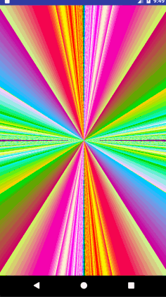

# OpenglPicture
This project is the same as [AndroidMathematicalArt](https://github.com/Chaoba/AndroidMathematicalArt) except that pictures in AndroidMathematicalArt are produced by c++ codes, while in this project by opengl.

